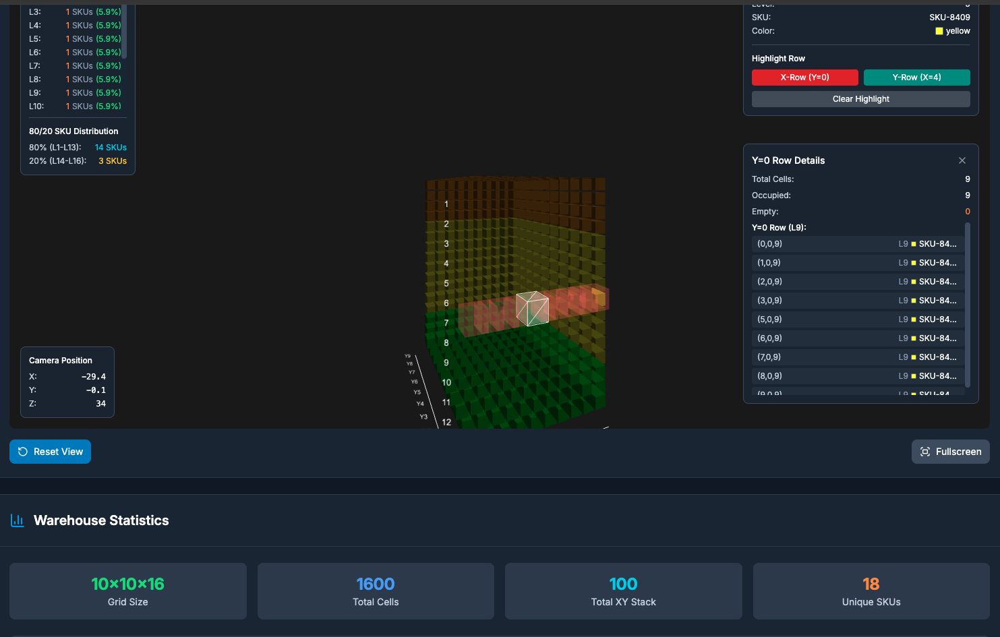
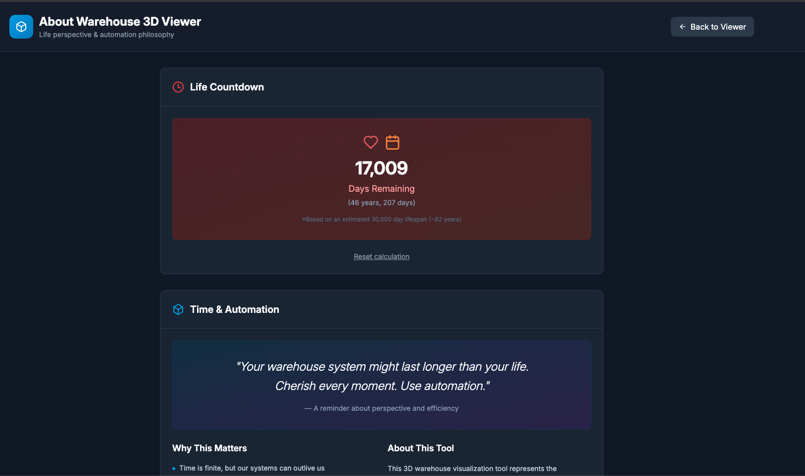

# Warehouse 3D Viewer

A modern React application for interactive 3D warehouse SKU visualization, built with Next.js 15.4 and Three.js.

** Live Demo**: https://warehouse-3d-viewer.vercel.app/  
** About Page**: https://warehouse-3d-viewer.vercel.app/about/





## Features

- **Interactive 3D Visualization**: Click, drag to rotate, scroll to zoom
- **SKU Management**: Load and visualize warehouse inventory data
- **Advanced Analytics**: SKU distribution by level, 80/20 analysis
- **Row Highlighting**: Interactive X-row and Y-row visualization
- **Life Countdown**: Philosophical perspective on time and automation

## Technology Stack

- **Frontend**: Next.js 15.4 with TypeScript
- **React**: React 19.1 with modern hooks
- **3D Graphics**: Three.js with InstancedMesh optimization
- **Styling**: Tailwind CSS with custom dark theme
- **Deployment**: Vercel-optimized static export

## Getting Started

1. Clone the repository:
```bash
git clone https://github.com/nicksonthc/warehouse-3d-viewer.git
cd warehouse-3d-viewer
```

2. Install dependencies:
```bash
npm install
```

3. Run the development server:
```bash
npm run dev
```

4. Open [http://localhost:3000](http://localhost:3000)

## Usage

### Data Format

Input warehouse data in JSON format:

```json
[
  {
    "level": 1,
    "sku": "SKU-0001",
    "color": "red"
  }
]
```

### Grid Configuration

- **X Size**: Warehouse width (1-20)
- **Y Size**: Warehouse depth (1-20)  
- **Z Size**: Number of levels (1-30)

## Development Commands

```bash
npm run dev      # Start development server
npm run build    # Build for production
npm run lint     # Lint code
npx tsc --noEmit # Type checking
```

## Philosophy

*"Your warehouse system might last longer than your life. Cherish every moment. Use automation."*

This project embodies the intersection of technical excellence and human reflection, reminding us to use automation to free up space for meaningful work.

## License

MIT License - see LICENSE file for details.